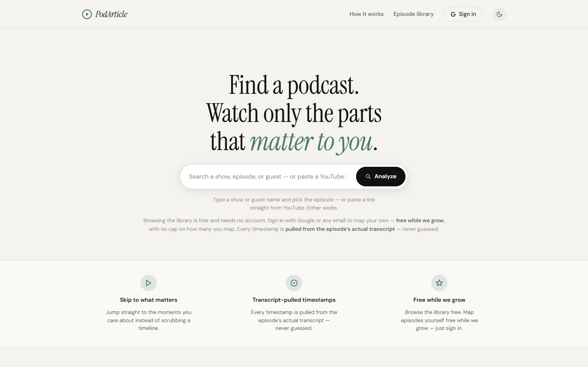
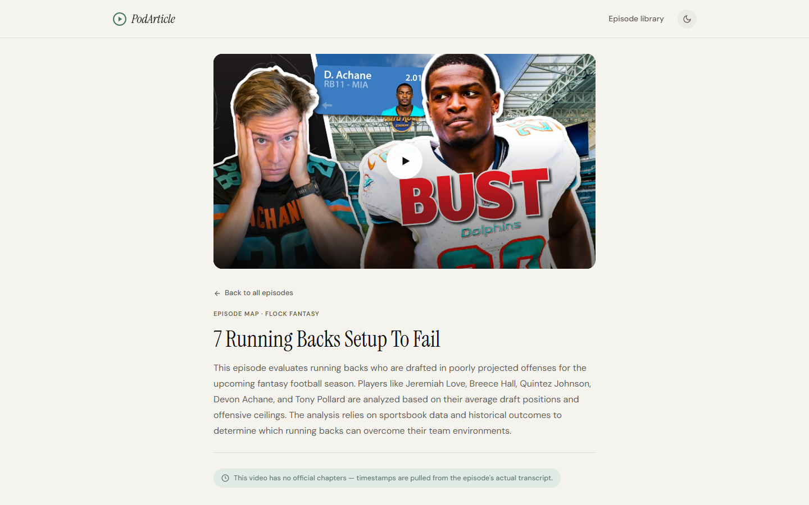

# PodArticle

**Find a podcast. Watch only the parts that matter to you.**

PodArticle turns long-form YouTube podcast episodes into searchable episode maps: transcript-pulled, timestamped sections you can click to seek, concise summaries, and shareable deep links to any moment.

**Live:** [podarticle.com](https://podarticle.com)



## What it does

- **Search-first discovery** — type a show, episode, or guest; live YouTube results start analysis on selection (pasting a URL works too)
- **Episode maps** — an LLM-generated section map with timestamps pulled from the episode's actual transcript, never guessed
- **One-click seek** — the embedded YouTube player jumps straight to the moment you care about
- **Shareable moments** — server-rendered deep links (`/e/<video-id>?t=<seconds>`) with social metadata in the initial HTML
- **Library** — a curated public library anyone can browse, plus a personal library per signed-in reader



## Architecture

```
Browser (static HTML/JS, no build step)
   │
   ▼
Vercel ── Node serverless functions (/api/*)
   │        ├─ /api/analyze     → metadata + transcript → LLM map → store
   │        ├─ /api/episode-page → server-rendered share pages
   │        └─ /api/sitemap     → dynamic sitemap for discovery
   ▼
Supadata (transcripts) ──► Gemini (episode map) ──► Supabase (Postgres + Auth)
```

| Layer | Choice |
|---|---|
| Frontend | Vanilla HTML/JS static pages (server-rendered where crawlers matter) |
| Backend | Node serverless functions on Vercel |
| Database & auth | Supabase Postgres with Row-Level Security, Google + email OAuth |
| Transcripts | Supadata API |
| LLM | Gemini Flash Lite |
| Payments | Stripe (dormant — free mode via `PAYWALL_ENABLED` flag) |

## Engineering highlights

- **Transcript-grounded timestamps** — the pipeline polls long transcript jobs and rejects any map whose transcript covers under 60% of the video's duration; all copy says "pulled from the actual transcript," never "verified"
- **Multi-tenant library** — a `library_entries` join table with RLS separates the globally reusable episode map from each reader's personal library, so cache hits never lose per-user ownership
- **Crawler-safe sharing** — share pages are server-rendered because X and other crawlers don't execute client-side metadata injection; OG thumbnails are proxied and cached from our own domain
- **Cost guards** — videos over 5 hours are rejected before any transcript/model spend; bulk seed runs are idempotent and provider-paced
- **Creator-safe playback** — official YouTube embeds preserve the creator's player, views, and ad delivery
- **Config-driven monetization** — Stripe checkout, billing portal, and usage gating ship in the codebase but stay dormant behind `PAYWALL_ENABLED`

## Status

Live and stable in maintenance mode as of August 2026. Free to use.

## Development

All configuration is environment-driven; no secrets live in this repo.

| Variable | Purpose |
|---|---|
| `SUPABASE_URL` / `SUPABASE_ANON_KEY` / `SUPABASE_SERVICE_ROLE_KEY` | Supabase project (Settings → API) |
| `GEMINI_API_KEY` / `GEMINI_MODEL` | Episode-map generation |
| `SUPADATA_API_KEY` | Transcript retrieval |
| `PAYWALL_ENABLED` | `false` = free mode |
| `STRIPE_*` | Dormant billing path |

Deploys run through the Vercel CLI (`vercel --prod`).

---

Built by Ben ODonnell. Code shared for review; not licensed for reuse.
